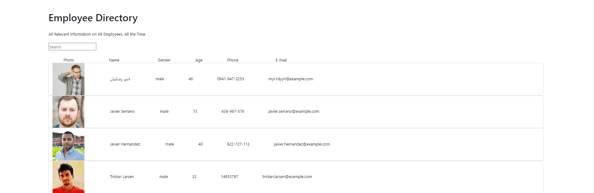

  
  
  # GitHub Username
  ## Mugen430
  

  # Email
  ## acampado.maverick@gmail.com

  # Project Name
  ## Employee-Directory

  # Installation Instructions
  ## Upon cloning or downloading repo, run *npm i* to have necessary dependencies installed for proper functionality, then proceed to localhost:3000

  # License
  ## MIT

  # Collaborators
  ## N/A